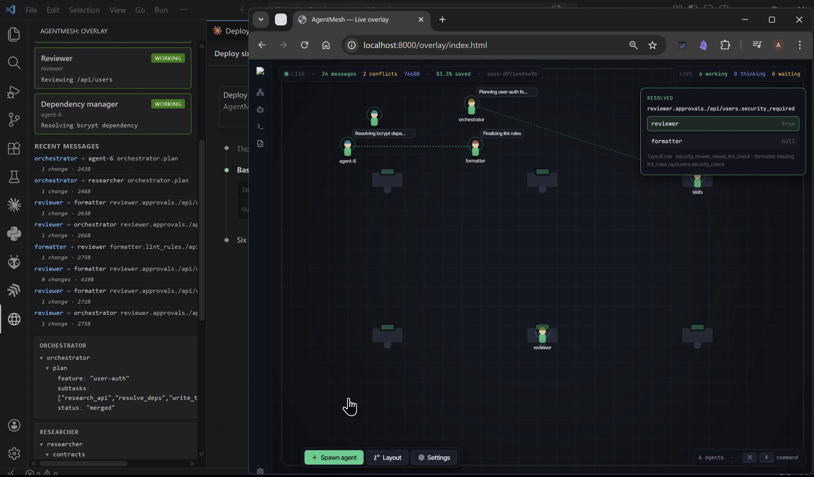

# AgentMesh

> **A deterministic coordination protocol for AI-to-AI communication.** File-as-interface, path-addressable state, zero LLM calls on the hot path.



## Problem

Multi-agent AI setups today coordinate in one of two broken ways:

1. **Orchestrator bottleneck.** Every inter-agent message gets summarized by a central LLM, losing semantic signal each hop and burning tokens linearly with participants. Context degrades like a telephone game.
2. **Retrofit tax.** Chat threads, IDEs, and ticket systems were built for humans. Using them as the substrate between agents adds latency, format mismatches, and serialization overhead that models waste tokens papering over.

Both approaches treat AI-to-AI coordination as a *human workflow problem*. It isn't. It's an infrastructure problem.

## What AgentMesh is

A file-based, protocol-driven communication layer that sits **between** agents. Each major agent is paired with a **Mini Agent sidecar** — a small Python process that owns three files (`context.json`, `summary.json`, `input.json`) plus a versioned dictionary store (`dictionary.json`). Agents never talk directly; Mini Agents mediate all coordination.

Three design principles:

1. **File as interface.** Communication is JSON on disk. Anything that can read or write JSON can participate — no vendor SDK, no sockets, no shared database between agents.
2. **Minimum viable context.** When agent A changes `backend.routes./api/users.auth_required`, agent B receives only that dot-path and its diff — not the whole backend state. Dependency maps declare who cares about what.
3. **Sidecar mediation.** Major agents focus on their coding task. Mini Agents handle diffing, routing, conflict detection, and delivery — deterministically, with zero LLM involvement.

## What's in the box

```
┌──────────┐   ┌──────────┐   ┌──────────┐       Any producer: real LLM
│ Agent A  │   │ Agent B  │   │ Agent C  │       (Claude Code, Codex,
│          │   │          │   │          │       Gemini, Ollama) or a
└────┬─────┘   └────┬─────┘   └────┬─────┘       scripted driver.
     ▼              ▼              ▼
┌──────────┐   ┌──────────┐   ┌──────────┐       Python sidecar. File
│Mini Agent│<->│Mini Agent│<->│Mini Agent│       watcher, diff engine,
│          │   │          │   │          │       router, dual-mechanism
└────┬─────┘   └────┬─────┘   └────┬─────┘       conflict resolver.
     └──────────┬───┴──────────────┘
                ▼
         ┌──────────────┐
         │ WebSocket    │                        Structured event stream
         │ :9900        │                        (pydantic-validated).
         └──────┬───────┘
                ▼
    ┌─────────────────────────┐
    │ VS Code sidebar +       │                  Live agent cards, dict
    │ browser overlay         │                  tree, conflict panel,
    │ (pixel-office view)     │                  message courier anims.
    └─────────────────────────┘
```

| Component | What it does |
|---|---|
| **Dictionary store** | Nested JSON, dot-path addressable (`backend.routes./api/users.auth_required`), monotonically versioned, atomic writes via `tempfile.mkstemp` + `os.replace`, per-mutation history log |
| **Diff engine** | Path-aware structural diff. Preserves URL segments (`/api/users` stays one token). Emits add / modify / delete ops. |
| **Router** | Dependency-map-driven fan-out. Glob-style patterns (`routes.*`, `schema.**`) with segment-aware matching. Collapses related changes into one message per subtree. |
| **Conflict engine (Type A)** | Direct path collision — two agents wrote the same dot-path with different values. Resolved via a deterministic priority table keyed by path category. |
| **Conflict engine (Type B)** | Semantic cross-reference rules — different paths must stay consistent (e.g., if a route requires auth, the caller must have an Authorization header). Declared as Python dataclasses with trigger path globs, value predicates, required peer path templates, and rule-specified winners. |
| **WebSocket event bus** | Nine event types (session lifecycle, state changes, dict mutations, routed messages, conflicts, 1 Hz metrics). Pydantic-validated. Tee'd to `session.jsonl` for replay. |
| **VS Code extension** | Activity-bar sidebar webview. Live agent cards, recent-messages feed, dict tree per agent, metrics strip. |
| **Browser overlay** | Pixel-office view. Agents as characters in a virtual workspace, messages as courier orbs, conflicts as resolution cards. |

**Zero LLM calls on the hot path.** Diffing, routing, and conflict resolution are pure code. Verified by running with `ANTHROPIC_API_KEY` and `OPENAI_API_KEY` unset — the protocol completes end-to-end.

## Run it

```bash
git clone https://github.com/AbhishekVulla/AgentMesh
cd AgentMesh
pip install -e .

# Terminal 1 — start the protocol bus
python -m mesh.run --config demo/config.yaml --duration 180

# Terminal 2 — drive the 6-agent scenario
python -m demo.run_scenario
```

Open `overlay/index.html` served via any static server (e.g. `python -m http.server 8000` then visit `http://localhost:8000/overlay/`) to see the live view. The VS Code extension loads from `extension/` — open that folder and press F5 for the Extension Development Host.

The reference scenario runs ~50 seconds, produces 24 routed messages across six agents, and triggers two semantic (Type B) conflicts that resolve via the priority table.

## Event schema

Canonical source: [`mesh/schemas/events.py`](mesh/schemas/events.py) (pydantic v2) → [`mesh/schemas/events.schema.json`](mesh/schemas/events.schema.json) (generated JSON Schema). TypeScript mirrors in [`extension/src/types/events.ts`](extension/src/types/events.ts).

Nine event variants: `mesh.session.started` / `mesh.session.ended` / `agent.state.changed` / `dict.mutated` / `message.sent` / `message.delivered` / `conflict.detected` / `conflict.resolved` / `metrics.tick`. Field-level documentation in [`docs/WEBSOCKET_SCHEMA.md`](docs/WEBSOCKET_SCHEMA.md).

## Repository layout

| Path | Contents |
|---|---|
| [`mesh/`](mesh/) | Python protocol — Mini Agent, dictionary store, diff engine, router, conflict resolver, WebSocket server |
| [`extension/`](extension/) | VS Code extension — sidebar webview, live WS client, dictionary tree |
| [`overlay/`](overlay/) | Browser overlay — pixel-office canvas, conflict cards, metrics |
| [`demo/`](demo/) | Reference scenario driver + config (dependency map, priority table) |
| [`docs/`](docs/) | Architecture, WebSocket schema, demo scenario timeline |

## Docs

- [`docs/ARCHITECTURE.md`](docs/ARCHITECTURE.md) — protocol architecture
- [`docs/WEBSOCKET_SCHEMA.md`](docs/WEBSOCKET_SCHEMA.md) — event contract
- [`docs/DEMO_SCENARIO.md`](docs/DEMO_SCENARIO.md) — reference scenario timeline
- [`docs/PRD.md`](docs/PRD.md) — product spec

## Scope note

The protocol is agent-agnostic: anything that writes `dictionary.json` participates. The reference demo uses scripted Python drivers so the scenario is reproducible and deterministic for documentation and testing purposes.

## Credits

The browser overlay's pixel-office aesthetic is inspired by [pablodelucca/pixel-agents](https://github.com/pablodelucca/pixel-agents) (MIT). No source from pixel-agents is forked or modified.

## License

MIT — see [LICENSE](LICENSE).
